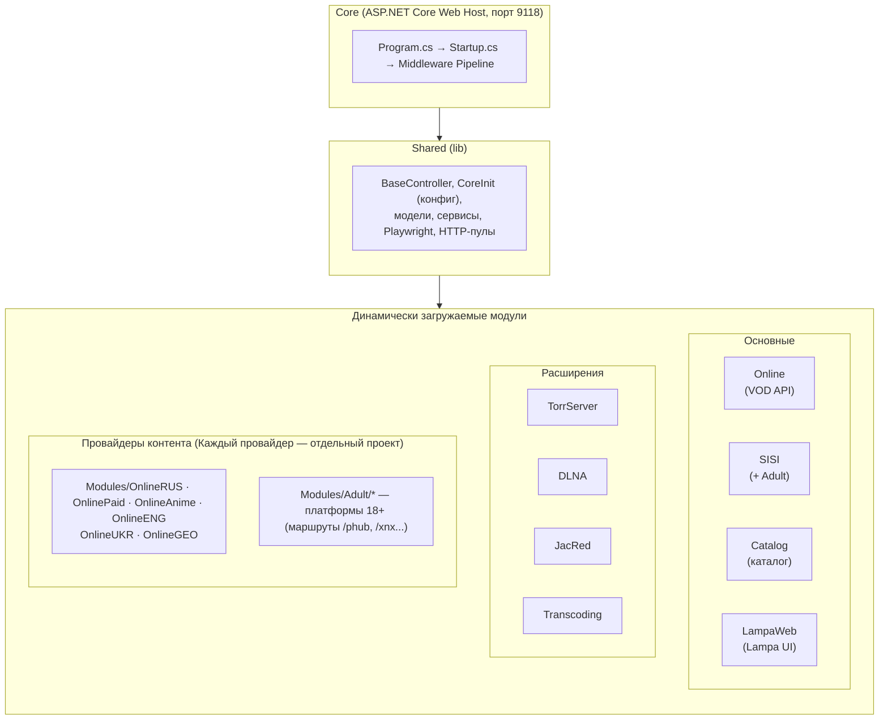

# Архитектура и структура проекта (Architecture)

Проект **Lampac Next Generation** спроектирован с упором на модульность, производительность и легкость обновления компонентов. Сердцем системы является приложение на базе **ASP.NET Core (.NET 10)**.

В этом документе описаны основные слои приложения, как они взаимодействуют и как работает механизм динамической компиляции.

---

## Общая схема архитектуры

---

## Описание слоев

### 1. Слой `Core`
Это точка входа приложения (`Core.dll`).
Здесь инициализируется хост, настраивается Dependency Injection (DI) и конфигурируется Middleware Pipeline. `Core` минимален и содержит в себе базовые контроллеры (например, эндпоинты статистики), RCH-реле и статические файлы, отдающиеся сервером (в папке `wwwroot`).

### 2. Слой `Shared`
Общая библиотека (`Shared.dll`), от которой зависят `Core` и все модули. Она не запускается самостоятельно, а предоставляет инфраструктуру:
- Парсинг и горячая перезагрузка файла конфигурации (`CoreInit.cs`).
- Общие базовые контроллеры (`BaseController`, `BaseOnlineController`).
- HTTP-клиенты, пулы памяти и кеширование (`HybridCache`).
- Интеграция с Microsoft Playwright для обхода JS-защит.
- Движок динамической компиляции (`CSharpEval`).

### 3. Слой `Online` и `SISI` (Ядра контента)
- **`Online`**: Ядро Video-On-Demand (VOD). Оно предоставляет сам плагин для Lampa (`/online.js`) и объединяет ответы от множества конкретных источников в единые маршруты агрегации (вида `/lite/withsearch`).
- **`SISI`**: Ядро контента 18+. Предоставляет плагин `/sisi.js`, базу данных SQLite для хранения истории и закладок пользователей.

Реализации конкретных сайтов-источников находятся в отдельных папках в каталоге `Modules/`.

### 4. Динамически загружаемые модули (`Modules/`)
Все провайдеры контента (Rezka, Kodik, PornHub и т.д.) и дополнительный функционал (TorrServer, DLNA, Админ-панель) оформлены как независимые модули.

---

## Динамическая компиляция (Roslyn / CSharpEval)

Одной из главных особенностей Lampac NextGen является способность компилировать и загружать C# код прямо во время работы (или при старте сервера), минуя жесткую пересборку всего решения.

**Как это работает:**
1. При старте `Core` сканирует папки `module/` и `mods/` (в скомпилированном релизе).
2. Если в папке находится файл **`manifest.json`**, движок **Roslyn** (`Microsoft.CodeAnalysis.CSharp.Scripting`) берет все `.cs` файлы в этой папке и компилирует их в сборку (DLL) прямо в памяти.
3. Сборка подключается к ASP.NET Core как часть приложения (динамически регистрируются контроллеры и маршруты).
4. Если в `manifest.json` указан флаг `"dynamic": true`, сервер отслеживает изменения в `.cs` файлах модуля и при сохранении файла "на лету" перекомпилирует и обновляет логику!

Это позволяет пользователям легко писать свои собственные плагины (создав папку в `mods/`) без необходимости устанавливать .NET SDK и собирать весь проект Lampac.

---

## Middleware Pipeline (Цепочка обработки)

Жизненный цикл входящего HTTP-запроса в `Core/Startup.cs` выглядит примерно так:

1. **`UseForwardedHeaders`** — определение реального IP за прокси (nginx, cloudflare).
2. **`UseBaseMod` / `UseRequestInfo`** — первичная инициализация контекста запроса.
3. **`UseRouting`** — маршрутизация ASP.NET.
4. **Сжатие и Кеш** — GZIP/Brotli и отдача кешированных ответов (`Staticache`).
5. **Проксирование** — обработка запросов на `/proxy/` и `/proxyimg` (для обхода CORS на клиенте).
6. **`UseWAF`** — Web Application Firewall (Геоблок, лимиты, блокировка ботов).
7. **`UseAccsdb`** — Аутентификация пользователя (проверка UID).
8. **Выполнение контроллера** — запрос достигает нужного модуля (например, парсера Rezka) и возвращает результат клиенту.
